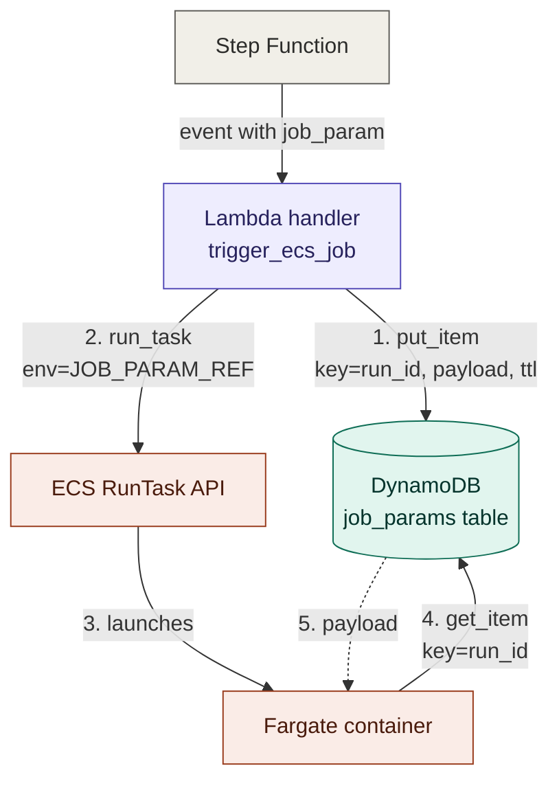

# job_param Flow Diagram

How `job_param` flows from the Step Function through the Lambda handler into
the Fargate container, using DynamoDB as the shared drop-off point (the
"claim check" pattern).

## Flow

## How to read it

1. **Step Function → Lambda** — Lambda is invoked with the full `job_param`
   inside the event payload.
2. **Lambda → DynamoDB (`put_item`)** — Lambda writes the payload to
   DynamoDB, keyed by `run_id`, with a 7-day TTL. This happens *first*,
   before any ECS call.
3. **Lambda → ECS RunTask** — Lambda triggers the container. The
   `overrides` block contains only `JOB_PARAM_REF = run_id` — not the
   payload itself.
4. **ECS → Container** — Fargate launches the container. The env var is
   now available inside it.
5. **Container → DynamoDB (`get_item`)** — on startup, the container reads
   `JOB_PARAM_REF` and uses it as the key to fetch the payload back.
6. **DynamoDB → Container (dashed arrow)** — payload returns. Container
   parses the JSON and runs the job.

## Key properties

- **Lambda never sends the payload to ECS.** The arrow between them
  carries only the reference (the `run_id`).
- **DynamoDB is the shared drop-off point.** Lambda writes, container
  reads. Neither service knows about the other directly — they only share
  the key.
- **Ordering matters.** The write (step 2) happens *before* the run
  (step 3). If the write fails, step 3 never happens, so the container
  never looks up a missing key.
- **Two different services write and read.** That's why both the Lambda's
  execution role AND the container's task role need DynamoDB permissions
  — but different ones (`PutItem` for Lambda, `GetItem` for the
  container).

## Why this pattern

The Fargate `RunTask` `overrides` block is capped at 8 KB total across all
env vars and command overrides combined. Passing a non-trivial `job_param`
inline hits that ceiling quickly and fails at launch with a confusing
`InvalidParameterException`.

By writing the payload to DynamoDB first and passing only the `run_id` as
a reference, the `overrides` block stays a few hundred bytes regardless
of payload size. DynamoDB items can be up to 400 KB — roughly 50× the
overrides limit — which is enough headroom for any realistic `job_param`.

This is commonly called the **claim check pattern** in messaging
architectures: instead of passing large data through the message channel
itself, you drop the data in a shared store and pass a ticket (the claim
check) that the consumer redeems later.
